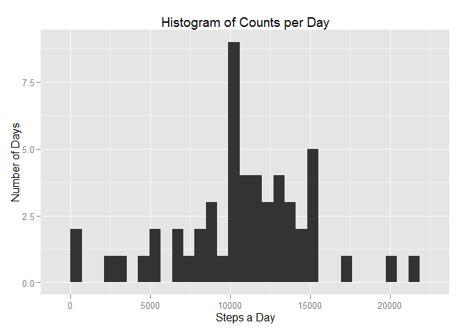
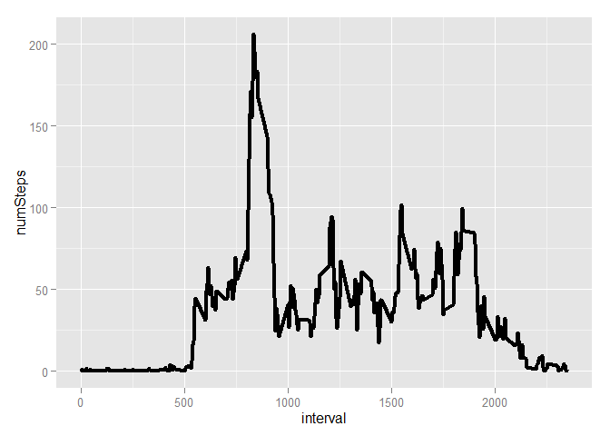
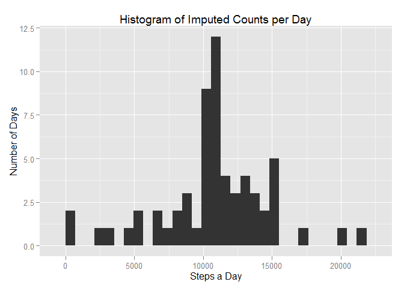
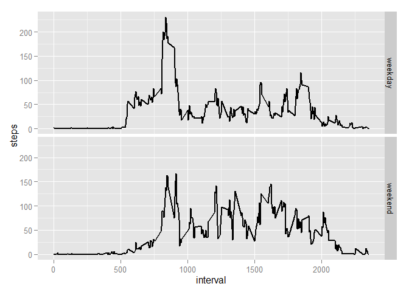

# Reproducible Research: Peer Assessment 1


## Loading and preprocessing the data


```r
data <- tempfile()
actDataZ <- unz("activity.zip", "activity.csv")
actData <- read.csv(actDataZ)

str(actData)
```

```
## 'data.frame':	17568 obs. of  3 variables:
##  $ steps   : int  NA NA NA NA NA NA NA NA NA NA ...
##  $ date    : Factor w/ 61 levels "2012-10-01","2012-10-02",..: 1 1 1 1 1 1 1 1 1 1 ...
##  $ interval: int  0 5 10 15 20 25 30 35 40 45 ...
```


## What is mean total number of steps taken per day?

### 1.Calculate the total number of steps taken per day

```
## Loading required package: dplyr
## 
## Attaching package: 'dplyr'
## 
## The following object is masked from 'package:stats':
## 
##     filter
## 
## The following objects are masked from 'package:base':
## 
##     intersect, setdiff, setequal, union
```

```r
#calculate steps per day
dataAggrPerDay <- actData %>% group_by(date) %>% summarize(sum(steps))
dataAggrPerDay <- data.frame(dataAggrPerDay)
names(dataAggrPerDay) <- c("date", "count")
```

### 2.If you do not understand the difference between a histogram and a barplot, research the difference between them. Make a histogram of the total number of steps taken each day

```
## Loading required package: ggplot2
```

```
## Warning: package 'ggplot2' was built under R version 3.1.3
```

```r
p <- ggplot(dataAggrPerDay, aes(x=count)) + 
        geom_histogram() +
        ggtitle("Histogram of Counts per Day") +
        xlab("Steps a Day") + 
        ylab("Number of Days")
p
```

```
## stat_bin: binwidth defaulted to range/30. Use 'binwidth = x' to adjust this.
```

 

### 3. Calculate and report the mean and median of the total number of steps taken per day

```r
meanStepsPerDay <- mean(dataAggrPerDay$count, na.rm=T)
medianStepsPerDay <- median(dataAggrPerDay$count, na.rm=T)
```

The mean number of steps taken each day is 10766.1886792.
The median number of steps taken each day is 10765.

## What is the average daily activity pattern?

### 1.Make a time series plot (i.e. type = "l") of the 5-minute interval (x-axis) and the average number of steps taken, averaged across all days (y-axis)


```r
meanStepsPerInterval <- actData %>% group_by(interval) %>% summarize(mean(steps, na.rm = T))
meanStepsPerInterval <- data.frame(meanStepsPerInterval)
names(meanStepsPerInterval) <- c("interval", "numSteps")

p <- ggplot(meanStepsPerInterval, aes(x=interval, y=numSteps))
p + geom_line(size=1.5)
```

 

### 2.Which 5-minute interval, on average across all the days in the dataset, contains the maximum number of steps?

```r
maxSteps <- max(meanStepsPerInterval$numSteps, na.rm=T)
maxIdx <- which(meanStepsPerInterval$numSteps == maxSteps)
maxInterval <- meanStepsPerInterval[maxIdx, 1]
```

The maximum steps averaged over all days is produced in interval 835 with  206.1698113 steps.

## Imputing missing values

### 1. Calculate and report the total number of missing values in the dataset (i.e. the total number of rows with NAs)

```r
numberNAs <- sum(is.na(actData$steps))
```
There are 2304 NAs in the dataset.

### 2. Devise a strategy for filling in all of the missing values in the dataset. The strategy does not need to be sophisticated. For example, you could use the mean/median for that day, or the mean for that 5-minute interval, etc.

The strategy chosen is to impute with the mean over all days from that 5-minute interval.

### 3. Create a new dataset that is equal to the original dataset but with the missing data filled in.


```r
# split the data set in the rows that have to be imputed and in the rows that are given
rowsToImpute <- actData[is.na(actData$steps), ]
rowsNotToImpute <- actData[!is.na(actData$steps), ]

# impute NAs with the calculated mean in that interval over all days
imputed <- merge(rowsToImpute , meanStepsPerInterval, by.x="interval", by.y="interval")
imputed <- imputed[order(imputed$date, imputed$interval),]
rowsToImpute$steps <- imputed$numSteps

imputedData <- rbind(rowsNotToImpute, rowsToImpute)
imputedData <- imputedData[order(imputedData$date, imputedData$interval),]

# check if successfully imputed
numberNAs <- sum(is.na(imputedData$steps))
numberNAs
```

```
## [1] 0
```

### 4. Make a histogram of the total number of steps taken each day and Calculate and report the mean and median total number of steps taken per day. Do these values differ from the estimates from the first part of the assignment? What is the impact of imputing missing data on the estimates of the total daily number of steps?

Aggregate imputed steps per day.

```r
#calculate steps per day
imputedDataAggrPerDay <- imputedData %>% group_by(date) %>% summarize(sum(steps))
imputedDataAggrPerDay <- data.frame(imputedDataAggrPerDay)
names(imputedDataAggrPerDay) <- c("date", "count")
```

Plot the aggregated histogram.

```r
library(ggplot2)
p <- ggplot(imputedDataAggrPerDay, aes(x=count)) + 
        geom_histogram() +
        ggtitle("Histogram of Imputed Counts per Day") +
        xlab("Steps a Day") + 
        ylab("Number of Days")
p
```

 

A change in in the bin around 10766 can be seen.

Calculate mean and median.

```r
imputedMeanStepsPerDay <- mean(imputedDataAggrPerDay$count, na.rm=T)
imputedMedianStepsPerDay <- median(imputedDataAggrPerDay$count, na.rm=T)
imputedMeanStepsPerDay
```

```
## [1] 10766.19
```

```r
imputedMedianStepsPerDay
```

```
## [1] 10766.19
```

The mean changed did not change (10766.19). 
The median changed from 10765 to 10766.19 (comma value was introduced during imputation)

## Are there differences in activity patterns between weekdays and weekends?

### 1. Create a new factor variable in the dataset with two levels - "weekday" and "weekend" indicating whether a given date is a weekday or weekend day.

```r
#convert the character date into POSIXct
tempDates <- strptime(imputedData$date, format="%F")

#set to english workdays
Sys.setlocale("LC_TIME","English")
```

```
## [1] "English_United States.1252"
```

```r
imputedData$weFlag <- (weekdays(tempDates) == "Saturday" | weekdays(tempDates) == "Sunday")
imputedData$weFlag[imputedData$weFlag == T] <- "weekend"
imputedData$weFlag[imputedData$weFlag == F] <- "weekday"
```


### 2. Make a panel plot containing a time series plot (i.e. type = "l") of the 5-minute interval (x-axis) and the average number of steps taken, averaged across all weekday days or weekend days (y-axis). See the README file in the GitHub repository to see an example of what this plot should look like using simulated data.

```r
aggregatedDataWithWeFlag <- imputedData %>% group_by(interval, weFlag) %>% summarize(mean(steps))
names(aggregatedDataWithWeFlag) <- c("interval", "weFlag", "steps")

p <- ggplot(aggregatedDataWithWeFlag, aes(x=interval, y=steps)) +
        geom_line(size=0.75) +
        facet_grid(weFlag ~ .)
p
```

 


Looking at the plot it can be derived that on weekends more people slept in than during the week. Over the day tendetially a bit more activity is seen.

